A demonstration of how Bitcoin works and a machine learning model to predict the price

Bitcoin is a decentralized digital currency that enables peer-to-peer transactions without the need for intermediaries such as banks or governments. Bitcoin operates on a decentralized ledger called the blockchain, which is a continuously growing list of records or "blocks" linked together and secured using cryptography. Each block in the chain contains a record of several transactions, and once a block is added to the chain, it cannot be altered. 

I have written some Python code which demonstrates how a blockchain works using PythonThe Wallet class is used to generate a public-private key pair for a wallet, which can be used to send and receive transactions. The Transaction class represents a single transaction, including the sender and recipient addresses and the amount being transferred. The Block class is used to group transactions together into a block, which is then added to the blockchain. The Blockchain class is responsible for maintaining the blockchain and handling transactions, including mining new blocks and validating transactions. This code demonstrates how the blockchain uses cryptography to secure and validate transactions, and how new blocks are added to the chain through a process called mining, which involves solving a cryptographic puzzle.

Bitcoin stores its blockchain through a distributed network of nodes that collectively maintain a copy of the entire blockchain. 

My code shows new blocks are added to the blockchain through a process called mining, which in my code involves solving a maths puzzle. 
By mining the block, wallets are rewarded with IronhackCoins which they can send to other wallets on the blockchain. In my code, the blockchain class serialises the chain to a JSON string and writes it to a file which is stored locally. It looks like this: 

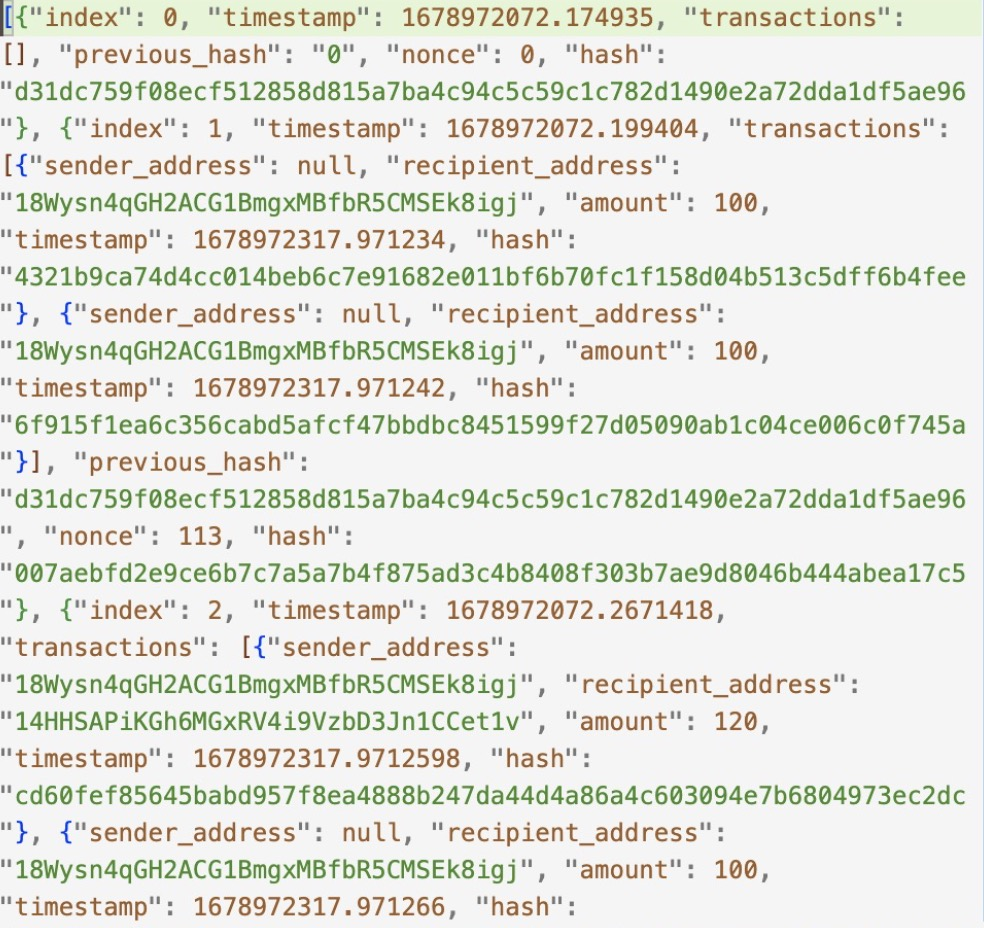

You can view my blockchain code and try it out for yourself on my Github repo.

Now we understand what Bitcoin is and how it works.

The next part of my project involved using machine learning to predict the price of Bitcoin.

The first part of this project was exploring the features that i would use in my model. I sourced data from a variety of sources that were linked to Bitcoin. 

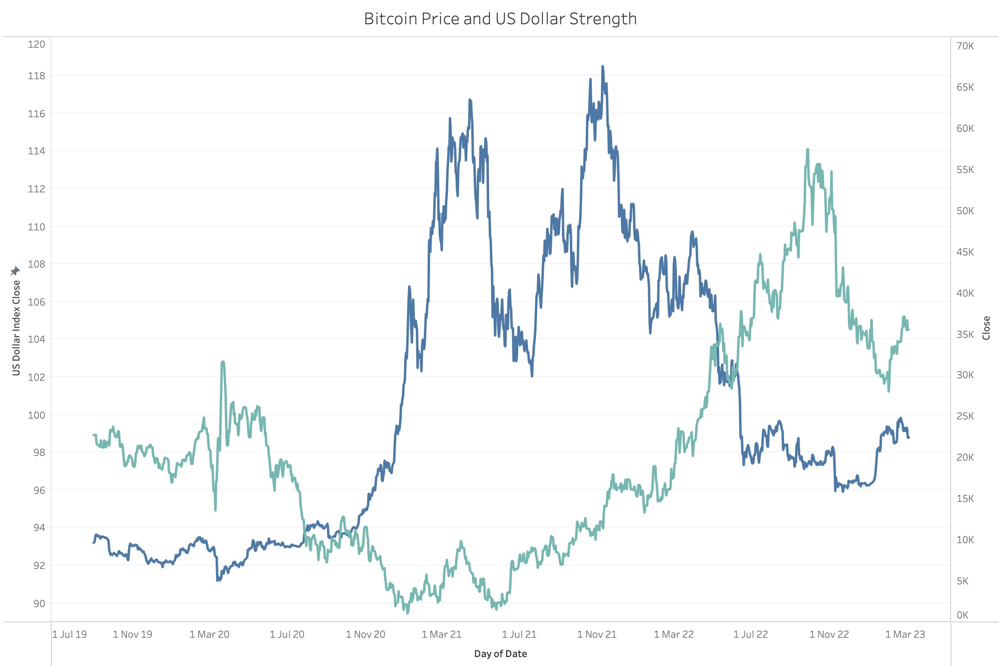
We can see here that there is a relationship between dollar strength and the price of Bitcoin. As the dollar began to weaken in March 2020, Bitcoin gan to rally. And as the dollar began to regain strength in July 2021, Bitcoin sold off. The sharp increase in dollar strength in November 2021 also coincided with the beginning otf the recent Bitcoin bear market. 

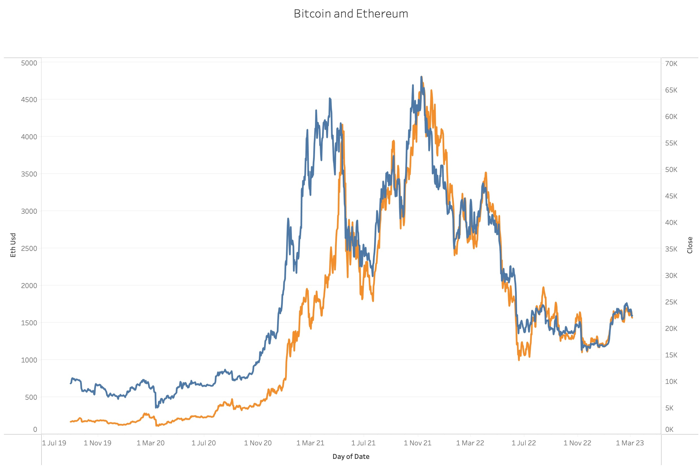
We can see in this graph that the price of Bitcoin is highly correlated with the price of the second largest cryptocurrency, Ethereum.

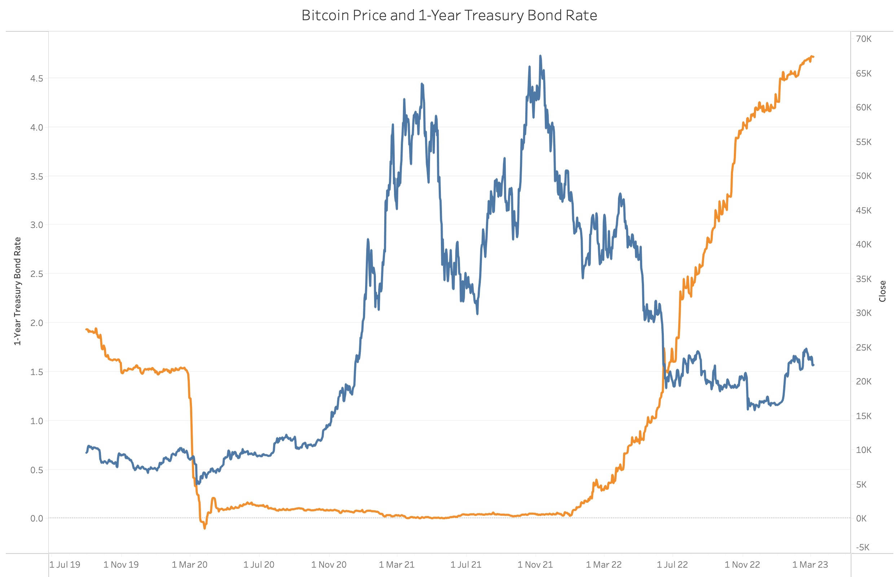
We can see here that there is a strong negative correlation between the price of Bitcoin and the interest rate on 1-Year Treasury bonds.

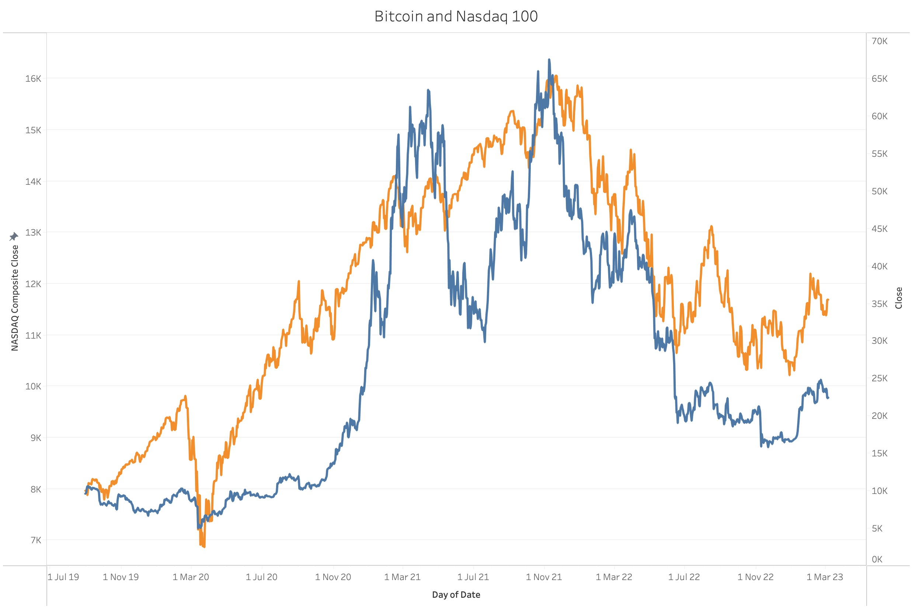
We can see here that Bitcoin is also highly correlated with the Nasdaq 100, an index of 100 of the largest technology companies in the US.

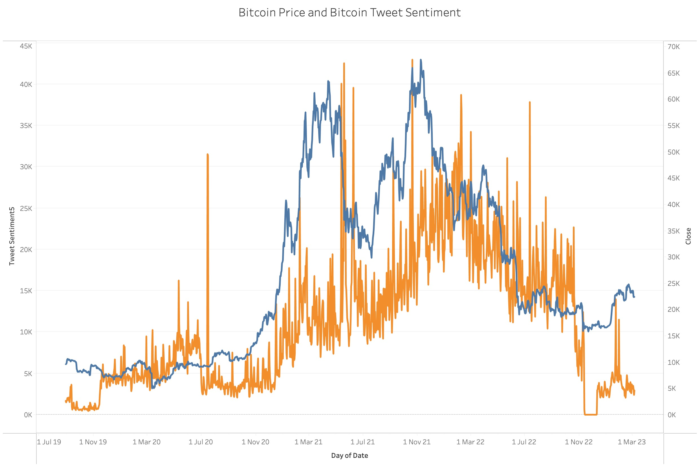
This chart plots the price of Bitcoin with the sentiment of tweets related to Bitcoin. 

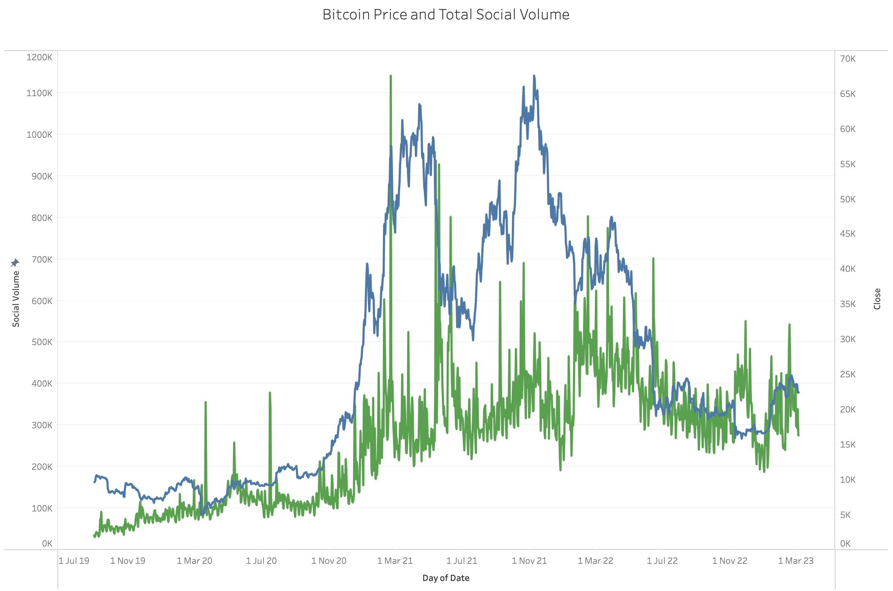

This graph plots the price of Bitcoin with total social volume, which is the bitcoin content across all social platforms. We can see that it follows the trend of the price.

In total I gathered daa for 67 different potential explanatory variables over the last 4 years. 

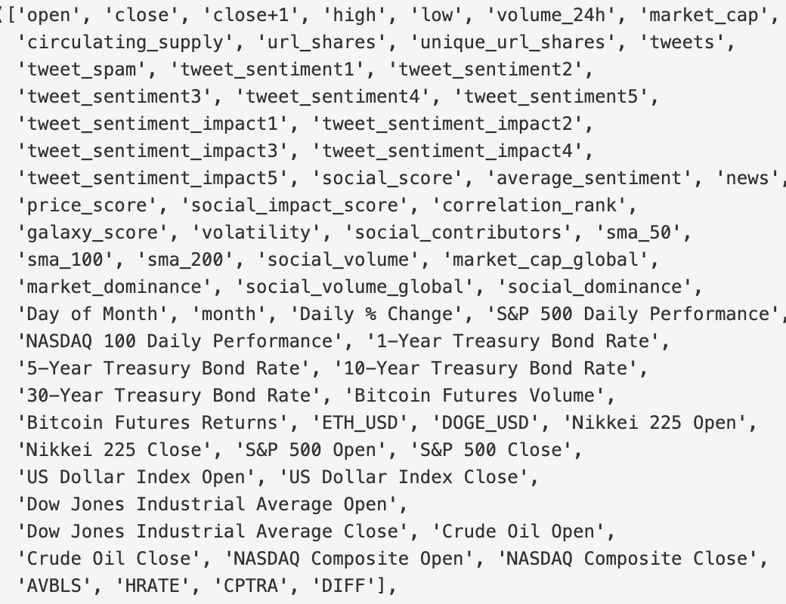

I cleaned the data and then moved onto the prediction component. 

For feature engineering I tried two approaches.

Approach 1: 

I calculated the Permutation Importance, Mean Decrease Impurity and Coefficient Importance for each variable using a Grid-search optimised Random Forest Regressor. For each feature, I calculated the average of these 3 importnce  scores and then ranked them according this average. I then dropped the bottom 27 to reduce the number of features to 40.

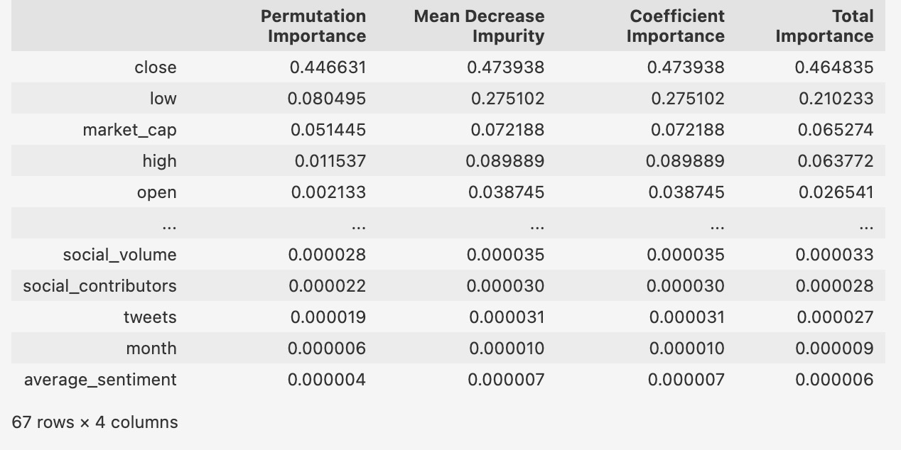

Next I use explained variance rations to reduce the number of features further.  I selected the number of principal components that retained at least 98% of total variance, which left me with 19 features. 

.................................................................

Approach 2:

My second approach focused more on correlation statistics. 

The first line of filtereing involved calcualted each varable correlation with the target variable and then dropping all variable which were very weakly correlated with the target variable (between 0.3 and -0.3)

To reduce multicollinearity in the remaining features, filtered variables that were highly correlated with each other. I then chose which of the correlated variables to drop based on their correlation with the target variable (close+1), I dropped the variable in the pair that was less correlated with the target variable. 

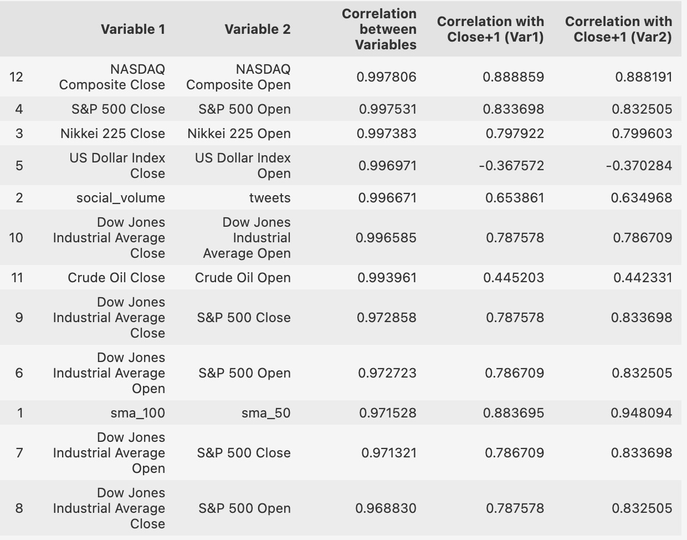

I then examined the variance inflation factors of the remaining variable and removed the highest scoring ones from the dataset to reduce multicolinearity further. 

......................................................................

Modelling:

I explored several models for this project including Support Vector Regressor, Random Forest, GRU Recurrent Neural Networks, Gradient Boosting Regressor and Prophet. 

The most accurate models were Gradient Boosting Regressor and Prophet. 

The second best performing model was Prophet, designed by Facebook. 
Prophet is a time series forecasting model developed by Facebook
It uses a decomposition approach to model the trend and seasonality in the data

I used the 5 Kbest features and the model achieved a MAPE of 4.34%.

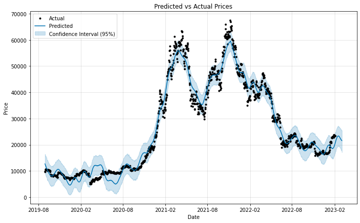

Part of the Prophet model involves examining the seasonality of the data. We can see here that Bitcoin does particulary well on Tuesdays and at the beginning of the year. 

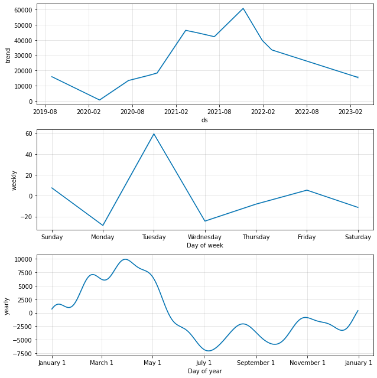

I then retested the Prophet model with new data from the last 2 weeks and again it did not perform as well as the Gradient Boosting Regressor, achieveing an MAPE of 5.98%

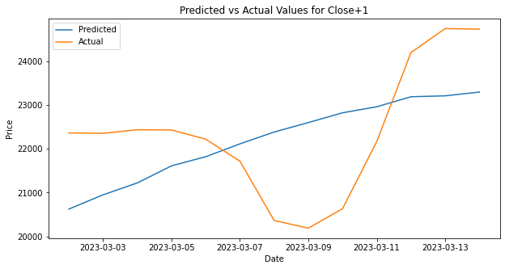

The best performing model was Gradient Boosting Regressor, is a machine learning algorithm that creates a predictive model by combining multiple weak models sequentially, with each new model attempting to correct the errors of the previous ones.

I tried two variations, one in which i selected the 8 Kbest features from the feature engineered dataset and another in which i created a for loop to deterrmine the optimal  number of Kbest features in order to reduce MAPE. 

With 8 Kbest features my model was able to predict the next day closing price of Bicoin with a MAPE of 2.94%.

The model which choose the optimal number of Kbest features selected just 2 feature, the close of the previous day and the high of the previous day, and was able to predict on the test data with an a slightly lower MAPE of 2.87%.

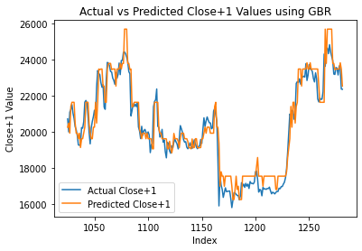

I then tested best performing model (Kbest number optmised) with new data from the last 2 weeks and the model predicted the price next day closing price of Bitcoin with a MAPE of 4.08%

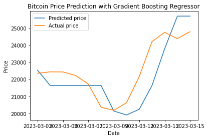

It should be added that part of the reason that both models performed worse on testng with data from the last few days is that Bitcoin rallied significatly as the result of a siginifcant banking collapse in the US and the model is unable to capture Black Swan events such as this. 